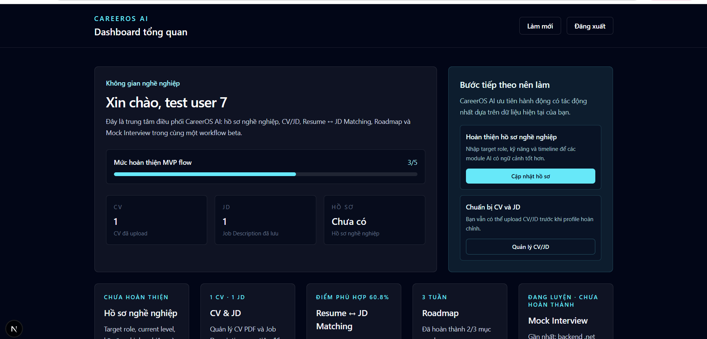
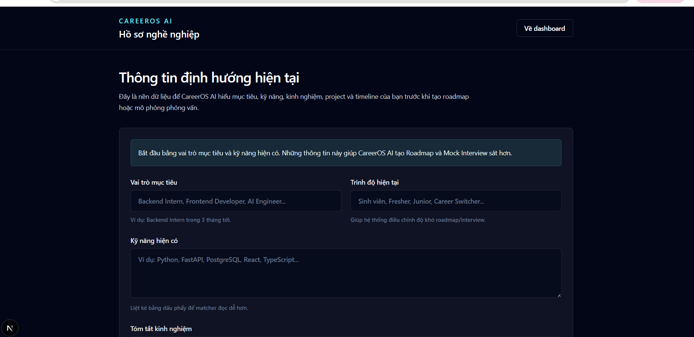
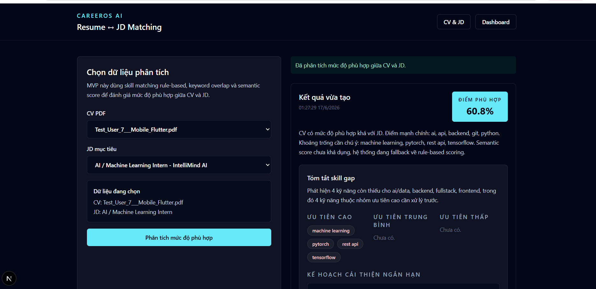
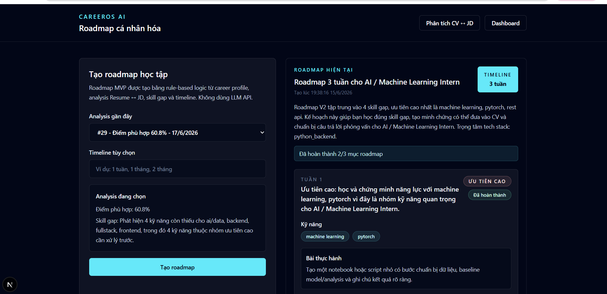
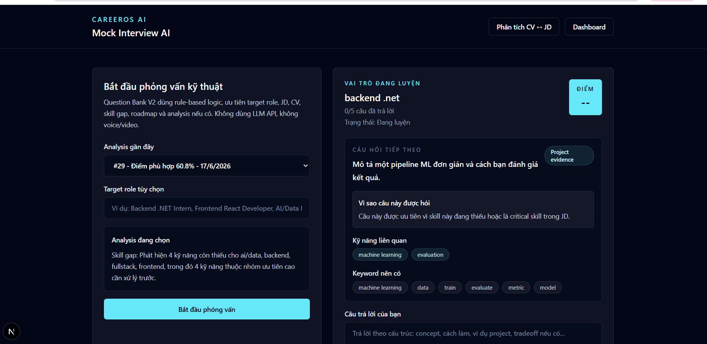
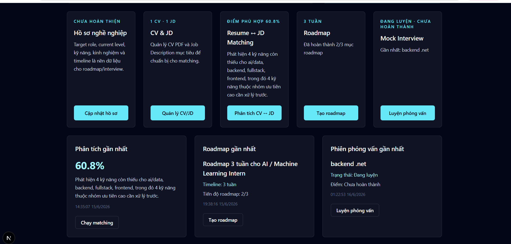

# CareerOS AI

**CareerOS AI** là nền tảng AI hỗ trợ người học và người đi làm trong lĩnh vực công nghệ hiểu năng lực hiện tại, so khớp CV với Job Description, phát hiện skill gap và xây dựng lộ trình phát triển nghề nghiệp có thể hành động.

- **Tình trạng:** Beta / MVP Production-Ready
- **Định hướng:** AI career intelligence platform
- **Mindset:** MVP-first, deterministic, explainable, startup/product-ready

## Giới thiệu sản phẩm

CareerOS AI là một web product hỗ trợ định hướng và phát triển nghề nghiệp trong lĩnh vực công nghệ. Sản phẩm hiện có các module chính: Career Profile, Resume ↔ JD Matching, Skill Gap Detection, Resume Improvement Suggestions, Personalized Roadmap V2, Mock Interview AI V2, Learning Loop Lite và Founder Insights Lite cho beta review.

AI trong CareerOS AI được thiết kế theo hướng deterministic và explainable: ưu tiên rule-based logic, scoring breakdown, detected skills, confidence signal và output có thể kiểm chứng. MVP hiện tại không phụ thuộc LLM API, không fine-tuning và không đưa ra lời khuyên nghề nghiệp kiểu black-box.

Định hướng sản phẩm là một startup/product thực tế: chạy được, deploy được, có test nền tảng, có workflow beta và có cơ chế học từ feedback của user thật.

## Bài toán thực tế cần giải quyết

Nhóm user mục tiêu của CareerOS AI bao gồm:

- Sinh viên công nghệ đang chuẩn bị intern/fresher.
- Intern, fresher và junior developer muốn apply đúng role.
- Người chuyển ngành muốn hiểu khoảng cách kỹ năng với vị trí mục tiêu.
- Người đã có CV nhưng không biết CV có match JD hay không.

Pain points chính:

- Không biết năng lực hiện tại phù hợp với role nào.
- Resume/CV không rõ có khớp với Job Description hay không.
- Không biết mình đang thiếu kỹ năng nào so với role mục tiêu.
- Không biết nên học gì trước và nên tạo evidence nào cho CV.
- Khó luyện phỏng vấn đúng role, đúng stack và đúng điểm yếu hiện tại.

CareerOS AI biến dữ liệu nghề nghiệp rời rạc thành insight rõ ràng, có thể hành động và có thể kiểm chứng bằng tiến bộ thật của user.

## Core Features

### Career Profile

- **Mục tiêu:** Lưu target role, current level, skills, experience, projects, career goal và timeline.
- **Cách hoạt động:** User tạo/cập nhật hồ sơ nghề nghiệp; backend duy trì một profile chính cho mỗi user.
- **Giá trị:** Tạo ngữ cảnh cho matching, roadmap, interview và các gợi ý cải thiện.

### Resume ↔ JD Matching

- **Mục tiêu:** Đánh giá mức độ phù hợp giữa CV và Job Description.
- **Cách hoạt động:** Extract text từ CV PDF/JD, detect skills, keyword overlap, role-family, stack group, evidence score và optional semantic similarity.
- **Giá trị:** User hiểu CV đang phù hợp với công việc mục tiêu ở mức nào và vì sao.

### Skill Gap Detection

- **Mục tiêu:** Phát hiện các kỹ năng còn thiếu theo mức độ ưu tiên.
- **Cách hoạt động:** So sánh skills trong JD với evidence trong CV, phân loại high / medium / low priority.
- **Giá trị:** User biết nên tập trung học và chứng minh kỹ năng nào trước.

### Resume Improvement Suggestions

- **Mục tiêu:** Biến kết quả analysis thành gợi ý sửa CV cụ thể.
- **Cách hoạt động:** Template-based feedback, chỉ gợi ý dựa trên evidence có thật trong CV; nếu chưa chắc, dùng conditional wording.
- **Giá trị:** User biết nên viết lại project/experience như thế nào mà không bị hallucinate thành tích giả.

### Personalized Roadmap V2

- **Mục tiêu:** Tạo kế hoạch học tập và hành động ngắn hạn dựa trên skill gap.
- **Cách hoạt động:** Rule-based roadmap gồm learning focus, practice task, CV evidence output, interview prep và priority.
- **Giá trị:** User biết nên làm gì tiếp theo và làm xong thì có thể thêm evidence nào vào CV.

### Mock Interview AI V2

- **Mục tiêu:** Luyện phỏng vấn kỹ thuật theo target role, JD, CV và missing skills.
- **Cách hoạt động:** Question bank deterministic theo role/stack; scoring bằng keyword overlap; feedback có category và gợi ý trả lời tốt hơn.
- **Giá trị:** User luyện đúng điểm yếu thay vì chỉ trả lời câu hỏi chung chung.

### Learning Loop Lite

- **Mục tiêu:** Biến CareerOS AI từ one-shot output thành learning loop nhẹ.
- **Cách hoạt động:** User đánh dấu roadmap item đã hoàn thành; dashboard gợi ý cập nhật CV và chạy lại matching.
- **Giá trị:** User có vòng lặp học → sửa CV → kiểm tra lại → luyện interview.

### Founder Insights

- **Mục tiêu:** Giúp founder hiểu beta users đang kẹt ở đâu và module nào có ích.
- **Cách hoạt động:** Aggregate funnel, useful feedback, common missing skills, match health và learning-loop signal từ dữ liệu sản phẩm hiện có.
- **Giá trị:** Hỗ trợ product decision mà không cần Mixpanel, PostHog hay admin dashboard lớn.

## Product Workflow

```text
Career Profile
  ↓
Upload CV + JD
  ↓
Resume ↔ JD Matching
  ↓
Skill Gap Detection
  ↓
Resume Feedback
  ↓
Personalized Roadmap
  ↓
Mock Interview
  ↓
Learning Loop
```

## Screenshots

### Dashboard Overview



### Career Profile



### Resume ↔ JD Matching



### Personalized Roadmap



### Mock Interview AI



### Learning Workflow Dashboard



## Tech Stack

### Frontend

- Next.js App Router
- React
- TypeScript
- Tailwind CSS

Stack này phù hợp dashboard/product UI, deploy nhanh trên Vercel, type-safe và dễ maintain.

### Backend

- FastAPI
- Python
- SQLAlchemy sync session
- pytest + FastAPI TestClient

FastAPI phù hợp với API rõ ràng, validation tốt và AI services bằng Python.

### Database

- PostgreSQL / Supabase

Lưu users, career profiles, resumes, job descriptions, analyses, roadmaps, interviews, usage events và feedback.

### Storage

- Supabase Storage private bucket cho CV/JD uploads
- Local `backend/uploads` chỉ là fallback cho local development

### Authentication

- JWT authentication
- Protected APIs filter user-owned resources bằng `current_user.id`

### AI/ML

- Rule-based matching
- Skill dictionary + aliases
- Role-family detection
- Stack mismatch penalty
- Evidence-aware scoring
- Sentence Transformers `all-MiniLM-L6-v2` optional
- scikit-learn / open-source models as future-compatible direction

Sentence Transformers có thể disable trong production Render Free để tránh load model/torch nặng lúc startup. Khi disabled, matcher fallback về rule-based scoring.

### Deployment

- Frontend: Vercel
- Backend: Render
- Database/Storage: Supabase

## Architecture Overview

```text
Frontend (Next.js + React + TypeScript)
        |
        | API over HTTPS
        v
Backend (FastAPI + Python)
        |
        | SQLAlchemy
        v
PostgreSQL / Supabase

AI Services
- Resume ↔ JD Matching
- Skill Gap + Resume Feedback
- Roadmap Generator
- Mock Interview Question Bank
- Founder Insights Aggregation

Storage
- Supabase Storage private bucket for CV/JD files
```

Kiến trúc hiện tại là modular monolith. CareerOS AI cố ý giữ hệ thống đơn giản, dễ deploy và dễ debug trước khi có tải thật.

## Project Structure

```text
CareerOS-AI/
├── backend/        # FastAPI backend, SQLAlchemy models, routers, AI services, tests
├── frontend/       # Next.js frontend, pages, API clients, auth context
├── docs/           # Deployment docs, benchmark docs, screenshots
├── context/        # Long-term project memory and phase reports
├── README.md
├── AGENTS.md
├── roadmap.md
└── .gitignore
```

## AI Philosophy / Design Principles

- **Explainable AI over black-box AI:** Mỗi score cần có breakdown, detected skills, confidence và lý do rõ ràng.
- **Rule-based + deterministic first:** Ưu tiên logic có thể debug, benchmark và calibrate.
- **No hallucinated career advice:** Không tự bịa user đã làm skill/project nếu CV không có evidence.
- **MVP-first:** Làm đủ dùng cho user thật trước, chưa thêm hệ thống phức tạp.
- **Human-actionable insights:** Output phải trả lời được câu hỏi "tôi nên làm gì tiếp theo?".
- **Production-ready but simple:** Có auth, validation, tests, deployment docs, storage production path, nhưng không thêm microservices, queues hay Kubernetes.

## Current Status

CareerOS AI hiện là Beta-ready MVP. Đã hoàn thành:

- Auth + protected routes
- Career Profile
- CV/JD upload với Supabase Storage fallback local
- Resume ↔ JD Matching V2.1
- Skill Gap Detection
- Resume Improvement Suggestions
- Personalized Roadmap V2
- Mock Interview AI V2
- Learning Loop Lite
- Founder Insights Lite cho beta review
- Backend pytest suite và frontend lint/build workflow

## Deployment

CareerOS AI đã được chuẩn bị theo hướng MVP production-ready:

- **Frontend:** deploy lên Vercel từ thư mục `frontend/`.
- **Backend:** deploy lên Render từ thư mục `backend/`.
- **Database:** Supabase PostgreSQL qua `DATABASE_URL`.
- **Storage:** Supabase Storage private bucket cho CV/JD.
- **Environment variables:** API URL, CORS, JWT, database, storage và Sentence Transformers config.

Tài liệu chi tiết: `docs/deployment.md`.

Production note: Render Free nên giữ `SENTENCE_TRANSFORMERS_ENABLED=false` để tránh startup timeout do model/torch load nặng. Matcher vẫn fallback rule-based an toàn.

## Future Roadmap

- Vietnamese/English language toggle.
- Stronger semantic matching khi infrastructure cho phép.
- Cải thiện roadmap quality dựa trên beta feedback.
- Richer interview coaching nhưng vẫn giữ deterministic/explainable nếu chưa cần LLM.
- Recruiter-facing insights là future scope, chưa phải ưu tiên hiện tại.
